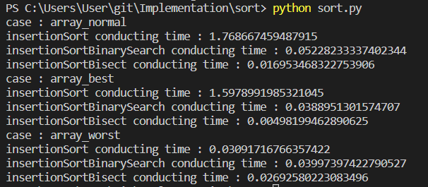
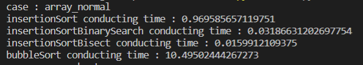
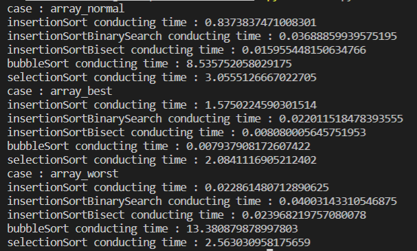

# Sort Implementation
## Insertion Sort
### code
```python
def insertionSort(array) : 
    res = []
    for i in range(len(array)) : 
        j = linearSearch(res,array[i])
        res.insert(j,array[i])
    return res
```
```python
def insertionSortBinarySearch(array) : 
    res = []
    for i in range(len(array)) : 
        j = binarySearch(res,array[i])
        res.insert(j,array[i])
    return res
```
```python
def insertionSortBisect(array) : 
    res = []
    for i in range(len(array)) : 
        j = bisect.bisect_left(res,array[i])
        res.insert(j,array[i])
    return res
```
### result


## Bubble Sort
### code
```python
def bubbleSort(array) : 
    swap = True
    while swap : 
        swap = False
        for i in range(len(array)-1) : 
            if array[i]>array[i+1] : 
                array[i+1], array[i] = array[i], array[i+1]
                swap=True
    return array
```
### result
  

## Selection Sort
```python
def selectionSort(arr) : 
    for i in range(len(arr)) : 
        minimum = (arr[i], i)
        for j in range(i,len(arr)) : 
            if arr[j]<minimum[0] : 
                minimum=(arr[j],j)
        arr[i], arr[minimum[1]] = arr[minimum[1]], arr[i]
    return arr
```
### result
