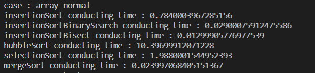
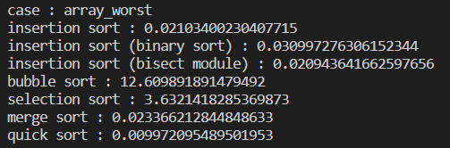
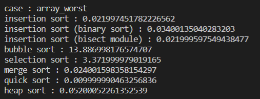

# Sort Implementation
## Insertion Sort
### code
```python
def insertionSort(array) : 
    res = []
    for i in range(len(array)) : 
        j = linearSearch(res,array[i])
        res.insert(j,array[i])
    return res
```
```python
def insertionSortBinarySearch(array) : 
    res = []
    for i in range(len(array)) : 
        j = binarySearch(res,array[i])
        res.insert(j,array[i])
    return res
```
```python
def insertionSortBisect(array) : 
    res = []
    for i in range(len(array)) : 
        j = bisect.bisect_left(res,array[i])
        res.insert(j,array[i])
    return res
```
### result


## Bubble Sort
### code
```python
def bubbleSort(array) : 
    swap = True
    while swap : 
        swap = False
        for i in range(len(array)-1) : 
            if array[i]>array[i+1] : 
                array[i+1], array[i] = array[i], array[i+1]
                swap=True
    return array
```
### result
  

## Selection Sort
```python
def selectionSort(arr) : 
    for i in range(len(arr)) : 
        minimum = (arr[i], i)
        for j in range(i,len(arr)) : 
            if arr[j]<minimum[0] : 
                minimum=(arr[j],j)
        arr[i], arr[minimum[1]] = arr[minimum[1]], arr[i]
    return arr
```
### result


## Merge Sort
```python
def mergeSort(array) : 

    if len(array)<=1 : 
        return array
    
    l,r = 0, len(array)
    m = len(array)//2

    res = []
    arr1 = mergeSort(array[l:m])[::-1]
    arr2 = mergeSort(array[m:r])[::-1]
    while arr1 and arr2 : 
        if arr1[-1]<arr2[-1] : 
            res.append(arr1.pop())
        else : 
            res.append(arr2.pop())
    while arr1 : 
        res.append(arr1.pop())
    while arr2 : 
        res.append(arr2.pop())
    
    return res
```

### result


## Quick Sort
```python
def divideConquer(array) : 
    if len(array) <= 1 : 
        return array
    
    pivot = array[len(array)//2]
    lower, equal, upper = [], [], []

    for x in array : 
        if x < pivot : 
            lower.append(x)
        elif x == pivot : 
            equal.append(x)
        else : 
            upper.append(x)
    return divideConquer(lower) + equal + divideConquer(upper)
```

### result


## Heap Sort
```python
def heapSort(arr) : 
    for i in range(len(arr) // 2 - 1, -1, -1):
        heapify(arr, i, len(arr))

    for i in range(len(arr) - 1, 0, -1):
        arr[0], arr[i] = arr[i], arr[0]
        heapify(arr, 0, i)

    return arr

def heapify(arr, now, size) : 
    max = now
    left=2*now+1
    right=2*now+2

    if left<size and arr[left]>arr[max] : 
        max=left
    if right<size and arr[right]>arr[max] : 
        max=right
    
    if now!=max : 
        arr[max], arr[now] = arr[now], arr[max]
        heapify(arr, max, size)
```

### result

