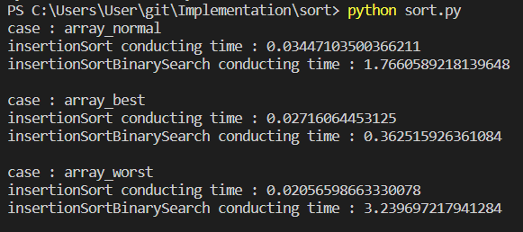
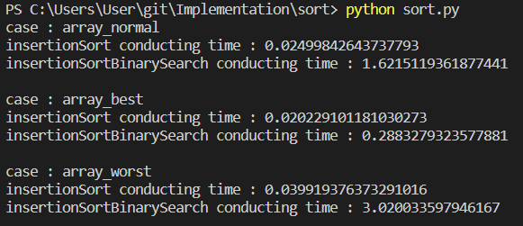

# Sort Implementation
## Insertion Sort
```python
def insertionSort(array) : 
    res = []
    for i in range(len(array)) : 
        for j in range(len(res)) : 
            if array[i]<res[j] : 
                res.insert(j,array[i])
    return res
```
```python
def insertionSortBinarySearch(array) : 
    res = []
    
    def bisect_left(arr, x, lo=0, hi=None) : 
        if lo < 0 :
            raise(Exception("io must be non-negative"))
        if hi is None : 
            hi = len(arr)
        while lo < hi : 
            mid = (lo+hi)//2
            if arr[mid] < x : 
                lo = mid+1
            else : 
                hi = mid
        return lo
    
    def insort_left(arr, x, lo=0, hi=None) : 
        if lo < 0 :
            raise(Exception("lo must be non-negative"))
        if hi is None : 
            hi = len(arr)
        while lo<hi : 
            mid = (lo+hi)//2
            if arr[mid]<x : 
                lo = mid+1
            else : 
                hi = mid
        arr.insert(lo,x)
            
    for x in array : 
        insort_left(res,x)
        
    return res
```
  
이진 탐색을 썼는데 그냥 했을 때 보다 느리다. 심지어 worst case일 때는 150배나 느린 것을 확인할 수 있다. 왜 그럴까?  
  
local method에서 global method로 바꿔봤다. 미묘하게 빨라지긴 했지만 여전히 linear search보다 느리다.